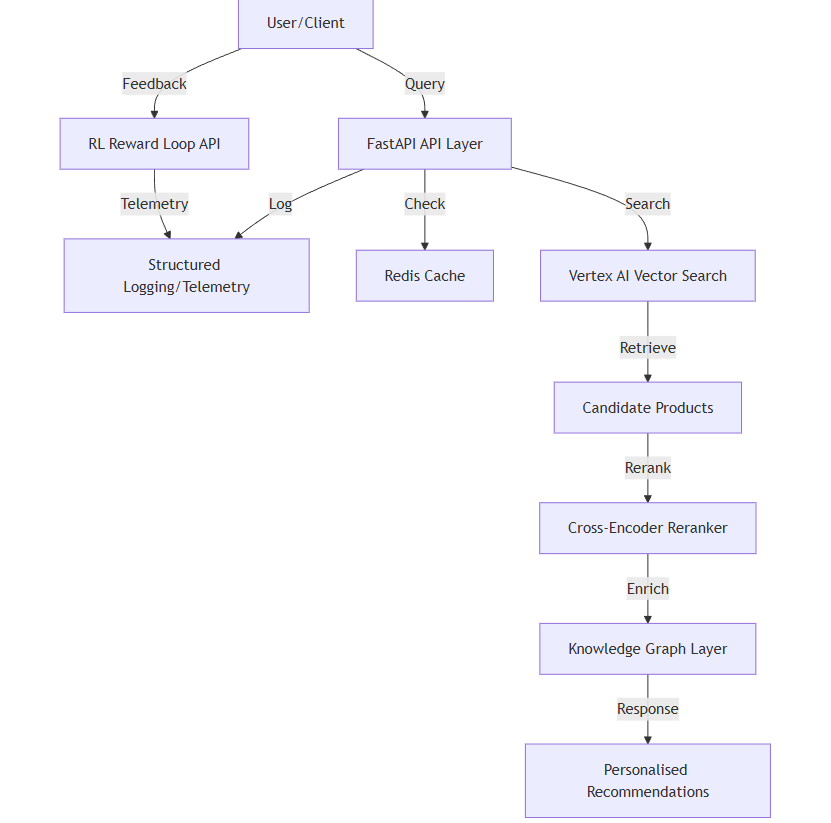

# IKEA-SmartSuggest: High-Scale Semantic Recommender

IKEA-SmartSuggest is a next-generation recommendation engine that understands user intent through semantics rather than just keywords. It leverages the Brazilian E-Commerce Public Dataset (Olist) to simulate a real-world high-scale catalog.

## Architecture



The project follows **Clean Architecture** and **SOLID** principles to ensure maintainability, scalability, and testability.

- **Domain Layer**: Contains business entities and repository interfaces.
- **Infrastructure Layer**: Implements adapters for GCP (Vertex AI Search), Redis (Cache), and local data loading.
- **API Layer**: FastAPI-based endpoints for real-time recommendations.
- **Pipelines**: Offline scripts for embedding generation and index updates.

## Advanced Features (Ingka-Ready)

To ensure this project meets the standards of a global retailer like Ingka, several high-impact features were implemented:

- **Two-Stage Retrieval (Reranking)**: Uses a fast Bi-Encoder for initial search and a powerful Cross-Encoder (`ms-marco-MiniLM-L-6-v2`) for reranking the top candidates, achieving superior semantic accuracy.
- **Latency Optimization (Singleton)**: Implemented a Singleton pattern for dependency injection, ensuring that heavy models and embeddings are loaded only once at startup, keeping sub-100ms response times.
- **Structured Observability**: All requests are processed through custom middleware that generates structured JSON logs, enabling advanced telemetry and audit trails.
- **High Availability (HA)**: Cloud-native health (`/health`) and readiness (`/ready`) probes ensure the service can be resiliently orchestrated by Kubernetes or GCP Cloud Run.

## Getting Started

### Prerequisites

- Python 3.10+
- Docker & Docker Compose
- (Optional) GCP Account with Vertex AI enabled

### Environment Variables

Before running the project, create a `.env` file based on `.env.example`:

```bash
cp .env.example .env
```

Edit `.env` and provide your GCP and local data path configurations.

#### Finding your Vertex AI Index ID
1. Go to the [Google Cloud Console](https://console.cloud.google.com/).
2. Navigate to **Vertex AI** > **Vector Search**.
3. Create an Index and an Index Endpoint if you haven't already.
4. The **Index ID** is a numeric string found in the "Index ID" column of the Indexes list.

### Installation

1. Clone the repository.
2. Create and activate a Virtual Environment:

   **Windows (PowerShell):**
   ```powershell
   python -m venv .venv
   .\.venv\Scripts\Activate.ps1
   ```

   **Linux/WSL/macOS (Bash):**
   ```bash
   python3 -m venv .venv
   source .venv/bin/activate
   ```

   > [!IMPORTANT]
   > Se você criou o ambiente no Windows e está tentando ativar no WSL (ou vice-versa), ele não funcionará. Você deve criar o ambiente de dentro do terminal que pretende usar.

3. Install dependencies:
   ```bash
   make install
   ```

### Running Locally

To run the API with hot reload:
```bash
make run
```

To run the entire stack (API + Redis) using Docker:
```bash
make docker-up
```

### Cloud Deployment (GCP Cloud Run)

To deploy the API to a production-grade serverless environment on Google Cloud:

1.  **Authenticate with GCP**:
    ```bash
    gcloud auth login
    gcloud config set project [YOUR_PROJECT_ID]
    ```
2.  **Deploy**:
    ```bash
    make deploy
    ```
    This command builds the image via Cloud Build and deploys it to Cloud Run with 2GB of RAM (optimized for Transformer models).

### Exploratory Data Analysis

A detailed EDA is available in the `notebooks/` directory:
- [eda_analysis.ipynb](notebooks/eda_analysis.ipynb)

## Project Structure

```plaintext
ikea_recommender/
├── app/
│   ├── api/                # Controllers/Routes
│   ├── core/               # Global configuration
│   ├── domains/            # Business Logic (Entities & Services)
│   └── infrastructure/     # External implementations (GCP, Redis, Data)
├── pipelines/              # Offline processing
├── models/                 # Model definitions
├── tests/                  # Unit and integration tests
├── Dockerfile
├── docker-compose.yml
├── Makefile
└── requirements.txt
```

## Testing

Run unit tests using the Makefile:
```bash
make test
```

## License

This project is licensed under the MIT License.
